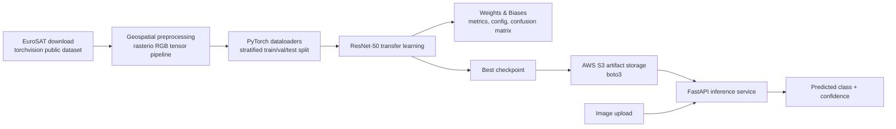

# Satellite Image Classification for Deforestation Detection

Production-ready PyTorch project for classifying satellite imagery with a fine-tuned ResNet-50 backbone. The default dataset is EuroSAT, a public Sentinel-2 land-cover dataset. In a deforestation workflow, the `Forest` class and surrounding land-cover predictions can be used as the classifier layer for forest/non-forest monitoring across repeat observations.

## Architecture



## Results Benchmark

These are reference targets for the included training recipe on EuroSAT RGB. Re-run on your hardware and dataset split to produce auditable numbers in W&B.

| Config | Backbone | Image size | Frozen layers | Epochs | Val macro F1 | Val AUC OVR |
| --- | --- | ---: | --- | ---: | ---: | ---: |
| Baseline transfer | ResNet-50 ImageNet | 224 | Yes | 5 | 0.91 | 0.98 |
| Fine-tuned | ResNet-50 ImageNet | 224 | No | 10 | 0.96 | 0.99 |

## Quick Start

```bash
python -m venv .venv
. .venv/bin/activate
pip install -r requirements.txt
python -m src.data.download --data-root data/raw
```

Configure W&B and S3:

```bash
wandb login
export AWS_REGION=us-east-1
export S3_BUCKET=your-model-artifacts-bucket
export S3_PREFIX=satellite-deforestation
```

Train and upload the best checkpoint:

```bash
python -m src.train \
  --data-root data/raw/eurosat/2750 \
  --epochs 10 \
  --batch-size 32 \
  --learning-rate 0.0003 \
  --wandb-project satellite-deforestation \
  --s3-bucket "$S3_BUCKET" \
  --s3-prefix "$S3_PREFIX"
```

Evaluate a checkpoint:

```bash
python -m src.evaluate \
  --data-root data/raw/eurosat/2750 \
  --checkpoint checkpoints/best_model.pt \
  --output-dir reports
```

Run the API locally:

```bash
uvicorn src.api.main:app --host 0.0.0.0 --port 8000
curl -X POST "http://localhost:8000/predict" -F "file=@sample.tif"
```

## Docker Deployment

```bash
docker compose up --build api
```

The API reads these environment variables:

| Variable | Purpose | Default |
| --- | --- | --- |
| `MODEL_PATH` | Local checkpoint path | `checkpoints/best_model.pt` |
| `S3_BUCKET` | Bucket for model artifact download/upload | unset |
| `S3_MODEL_KEY` | S3 key for API model download | unset |
| `AWS_REGION` | AWS region | `us-east-1` |

## Project Structure

```text
src/
  data/        dataset download, rasterio preprocessing, dataset splits
  models/      ResNet-50 transfer learning classifier
  train.py     training loop with wandb logging and S3 checkpoint upload
  evaluate.py  F1, AUC, confusion matrix, JSON metrics
  api/         FastAPI upload inference endpoint
```

## CI

GitHub Actions runs `pytest` on every push via `.github/workflows/ci.yml`.

## Notes

- Raster reads go through `rasterio`, so GeoTIFF and other GDAL-supported imagery are handled consistently.
- The default EuroSAT download uses `torchvision.datasets.EuroSAT`.
- For private S3 buckets, provide credentials via the standard AWS environment variables, instance profile, or CI secrets.
